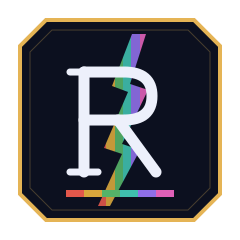

<p align="center">
  
</p>

<h1 align="center">Riftarium</h1>

<p align="center">
  <strong>Le compagnon tout-en-un pour Riftbound, le TCG de Riot Games.</strong><br />
  Cartothèque · Collection · Deck builder · Règles officielles · Communauté
</p>

<p align="center">
  <a href="LICENSE"></a>
  
  
  
  
  
</p>

<p align="center"><em>Projet fan-made à but non lucratif — non affilié à Riot Games.</em></p>

---

## Fonctionnalités

| Fonction | Description |
| --- | --- |
| **Cartothèque** | Les 1 315 cartes des 6 sets (Origins → Vendetta), variantes alt-art incluses. Recherche plein texte, filtres par domaine, type, rareté et set |
| **Règles** | Texte officiel intégral en français : 2 137 règles du jeu + 812 règles de tournoi, avec recherche |
| **Deck builder** | Validation des règles de tournoi (légende unique, 3 champs de bataille, 12 runes, 40 cartes minimum, 3 exemplaires max, conformité des domaines) ou mode libre |
| **Collection** | Inventaire personnel : quantités, état, langue — compte requis |
| **Communauté** | Decks publics, likes, tri par popularité |
| **Modération** | Chaque contenu publié passe par un filtre automatique avant mise en ligne ; le reste part en file de revue |

## Démarrage rapide

```bash
git clone https://github.com/Arcneell/riftarium.git
cd riftarium/riftarium
docker compose up --build -d
```

| Service | URL |
| --- | --- |
| Site | <http://localhost:8888> |
| API (OpenAPI) | <http://localhost:8889/docs> |

Au premier démarrage, l'API synchronise les ~1 300 cartes depuis
l'API communautaire [Riftcodex](https://api.riftcodex.com/docs) (~30 s).
Pour resynchroniser après une sortie de set : `curl -X POST http://localhost:8888/api/admin/sync`

> **Windows** : les ports par défaut sont 8888/8889 car Hyper-V réserve souvent les plages
> 7236-8035 et 8054-8553. Personnalisables : `PORT=3000 API_PORT=3001 docker compose up`.

## Architecture

```
┌────────────────────┐     ┌─────────────────────┐     ┌──────────────────┐
│  web  (Vue 3/Vite) │────▶│  api  (FastAPI)      │────▶│  db (PostgreSQL) │
│  nginx + SPA        │ /api│  auth JWT · decks    │     │  cartes · users  │
│  proxy /api         │     │  validation · modo   │     │  decks · likes   │
└────────────────────┘     └──────────┬──────────┘     └──────────────────┘
                                      │ resync manuelle possible
                           ┌──────────▼──────────┐
                           │ api.riftcodex.com    │  (données de cartes)
                           │ cmsassets.rgpub.io   │  (visuels — CDN Riot)
                           └─────────────────────┘
```

## Structure du dépôt

```
riftarium/          Application (produit)
├── apps/web/       Front Vue 3 + Vite, servi par nginx
├── apps/api/       API FastAPI (Python 3.12) + tests pytest
├── data/           Règles officielles en français (JSON)
└── compose.yaml    Orchestration Docker (web + api + db)
REFONTE.md          Plan technique et feuille de route
assets/             Identité visuelle (logo SVG)
```

## Tests

Chaque pull request est bloquée tant que la CI GitHub n'est pas verte
(lint, formatage, tests API, tests Vue, build Vite, `docker compose config`).

```bash
# API — depuis riftarium/
docker compose run --rm api pytest -q

# Qualité API en local (lint + format + couverture)
cd riftarium/apps/api
pip install -r requirements.txt -r requirements-dev.txt
ruff check app tests
ruff format --check app tests
pytest -q --cov=app --cov-report=term-missing

# Front — depuis riftarium/apps/web
npm ci
npm run check          # lint, Prettier, Vitest, build
```

## Feuille de route

- [x] Cartothèque, comptes, collection, deck builder, decks publics, modération V1
- [ ] Scan mobile (PWA + caméra, reconnaissance par empreinte visuelle)
- [ ] Estimation des prix via l'API Cardmarket
- [ ] Textes officiels FR/EN via l'API Riot (demande d'accès en cours — voir [REFONTE.md](REFONTE.md))
- [ ] Fil communautaire complet : pulls, résultats de tournoi, profils, commentaires

## Contribuer

Les issues et pull requests sont bienvenues. Avant de proposer une fonctionnalité qui
touche aux données Riot (visuels, textes de cartes), vérifiez qu'elle respecte la
[politique développeur Riftbound](https://developer.riotgames.com/policies/riftbound)
et la politique « Jargon juridique » de Riot Games.

## Mentions légales

Riftarium a été créé en vertu de la politique juridique de Riot Games intitulée
« Jargon juridique » relative à l'utilisation d'actifs de Riot Games. **Riot Games ne
soutient ni ne sponsorise ce projet.**

Riftbound, League of Legends et l'ensemble des visuels de cartes, illustrations, symboles
de domaine et textes officiels sont la propriété de © Riot Games, Inc. Les visuels sont
servis directement depuis le CDN officiel de Riot et ne sont ni copiés ni redistribués.
Cardmarket est une marque de Cardmarket GmbH. Le projet est et restera non commercial.

## Licence

Le code source de Riftarium est publié sous licence [MIT](LICENSE). Cette licence ne
couvre ni le texte des règles officielles, ni les illustrations, ni aucun actif
appartenant à Riot Games, Inc.
