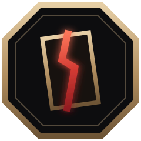

<p align="center">
  
</p>

<h1 align="center">Riftarium</h1>

<p align="center">
  <strong>Le compagnon francophone de Riftbound, le TCG de Riot Games.</strong><br />
  Cartothèque · Collection · Deck builder · Règles · Parties suivies · Échanges entre joueurs
</p>

<p align="center">
  <a href="LICENSE"></a>
  
  
  
  
  
</p>

<p align="center"><em>Projet fan-made gratuit et non commercial, non affilié à Riot Games. Bêta fermée, non indexée.</em></p>

---

Riftarium réunit au même endroit tout ce dont un joueur de Riftbound a besoin : chercher une
carte, suivre sa collection, construire un deck légal, apprendre les règles, noter ses parties
et trouver près de chez lui les cartes qui lui manquent. Le site est en français, sur ordinateur
comme sur téléphone, avec une application native iOS et Android en préparation.

## Fonctionnalités

| Rubrique | Ce qu'on y fait |
| --- | --- |
| **Cartes** | Les 1 315 cartes des six sets (Origins → Vendetta), variantes alt-art, overnumbered et signatures incluses. Recherche plein texte, filtres (set, type, domaine, rareté, énergie), fiche détaillée avec prix indicatif et variantes |
| **Collection** | Inventaire par lot (quantité, état, langue), complétion par set, export CSV, wishlist avec valeur estimée |
| **Échanges** | Liste « À échanger », correspondances avec la wishlist des autres joueurs de La Réunion (par zone), demandes avec contact dévoilé une fois l'échange accepté, notifications e-mail |
| **Decks** | Deck builder avec validation des règles de tournoi en direct, import et export de codes de deck, cartes manquantes d'après sa collection |
| **Communauté** | Decks publics, likes, vues, filtres par légende, domaine et format ; modération automatique avant publication |
| **Règles** | Guide d'apprentissage en chapitres courts, plateau animé, aide avancée par thème, texte officiel intégral en français (règles du jeu et de tournoi) avec recherche |
| **Jouer** | Salons à deux, compteur partagé, historique des matchs confirmés par les deux joueurs, statistiques par légende |
| **Profil** | Profil public réglable, hauts faits, amis, export RGPD et suppression du compte |

## Charte « Forge noxienne »

Le site a été entièrement refondu en octobre 2026 : noir de forge, rouge sang pour l'action,
bronze pour la matière, angles coupés, titres en Cinzel et texte en Barlow. Les visuels de jeu
(énergie, puissance, runes, mots-clés) reprennent les glyphes officiels de Riot. Charte et
composants : [riftarium/apps/web/README.md](riftarium/apps/web/README.md).

## Architecture

```
            ┌──────────────────────┐
 Internet ──│  BunkerWeb (WAF/TLS) │   réseau Docker `bunkerweb`
  HTTPS     └──────────┬───────────┘
                       ▼
 ┌─────────────────────┐      ┌──────────────────────┐      ┌───────────────────┐
 │ web  (Vue 3 + Vite) │─────▶│ api  (FastAPI)       │─────▶│ db (PostgreSQL 18)│
 │ nginx, SPA          │ /api │ auth · decks · jeu   │      └───────────────────┘
 │ proxy /api          │      │ échanges · e-mails   │      ┌───────────────────┐
 └─────────────────────┘      └───┬────────┬─────────┘─────▶│ redis 8           │
                                  │        │                │ cache + limites   │
 ┌─────────────────────┐          │        ▼                └───────────────────┘
 │ app mobile (Flutter)│──────────┘   api.riftcodex.com (données de cartes)
 │ iOS + Android       │   Bearer     cmsassets.rgpub.io (visuels, CDN Riot)
 └─────────────────────┘
```

## Structure du dépôt

```
riftarium/
├── apps/web/       Site Vue 3 + Vite, servi par nginx
├── apps/api/       API FastAPI (Python 3.14), migrations Alembic, tests pytest
├── apps/mobile/    Application Flutter (iOS + Android), jamais dans Docker
├── data/           Règles officielles en français (JSON)
├── docs/           Contrats d'API partagés par le site et le mobile
└── compose.yaml    Production : web + api + db + redis
assets/             Identité visuelle (logo)
docs/superpowers/   Specs de conception et plans d'implémentation
WORKFLOW.md         Organisation du dépôt, règles web / API / mobile, feuille de route
```

Documentation technique (déploiement, e-mails, migrations, sauvegardes) :
[riftarium/README.md](riftarium/README.md).

## Qualité

Chaque pull request est bloquée tant que la CI n'est pas verte : lint et formatage (ruff,
ESLint, Prettier), tests API (pytest) et site (Vitest), audit des dépendances, build des
images Docker et contrôle de sécurité de la configuration Compose. L'application mobile a sa
propre CI (format, analyse, tests Flutter).

- **Déploiement** : un merge dans `main` relance la CI puis déploie sur le VPS, avec
  sauvegarde de la base avant la mise à jour et retour automatique à la version précédente
  si le contrôle de santé échoue.
- **Schéma de base** : versionné par migrations Alembic, appliquées au démarrage de l'API.
- **Dépendances** : Dependabot chaque semaine ; les mises à jour mineures pip et npm sont
  fusionnées automatiquement quand la CI passe, les autres sont revues à la main.

## Feuille de route

- [x] Cartothèque, comptes, collection, wishlist, deck builder, communauté, modération
- [x] Règles en français : guide d'apprentissage, aide avancée, texte officiel
- [x] Parties suivies, statistiques, profils publics, hauts faits, amis
- [x] Refonte « Forge noxienne » du site
- [x] Échanges entre joueurs de La Réunion
- [ ] Publication de l'application mobile (App Store et Google Play), scan des cartes par la caméra
- [ ] Textes officiels via l'API Riot (demande d'accès en cours)

## Contribuer

Les issues et pull requests sont bienvenues. Avant de proposer une fonctionnalité qui touche
aux données Riot (visuels, textes de cartes), vérifiez qu'elle respecte la
[politique développeur Riftbound](https://developer.riotgames.com/policies/riftbound) et la
politique « Jargon juridique » de Riot Games. Organisation du dépôt et vérifications à lancer
avant de pousser : [WORKFLOW.md](WORKFLOW.md). En soumettant une contribution, vous acceptez
qu'elle soit intégrée au projet sous les termes de la [licence](LICENSE).

## Licence

Le code source de Riftarium est **accessible publiquement**, mais le projet **n'est pas
open source** : il est publié à des fins de transparence et de consultation uniquement.
Toute copie, reproduction, modification, redistribution, déploiement ou réutilisation du
code, en tout ou partie, est interdite sans autorisation écrite préalable de l'auteur.
Voir [LICENSE](LICENSE).

## Mentions légales

Riftarium isn't endorsed by Riot Games and doesn't reflect the views or opinions of Riot Games or anyone officially involved in producing or managing Riot Games properties. Riot Games, and all associated properties are trademarks or registered trademarks of Riot Games, Inc.

Riftarium n'est pas approuvé par Riot Games et ne reflète pas les opinions de Riot Games ni de quiconque officiellement impliqué dans la production ou la gestion des propriétés de Riot Games. Riot Games et toutes les propriétés associées sont des marques ou des marques déposées de Riot Games, Inc.

Riftarium was created under Riot Games' "Legal Jibber Jabber" policy using assets
owned by Riot Games. Riot Games does not endorse or sponsor this project.

Riftarium a été créé en vertu de la politique « Legal Jibber Jabber » (Jargon juridique)
de Riot Games, à partir d'actifs appartenant à Riot Games. Riot Games ne soutient ni
ne sponsorise ce projet.

Riftbound, League of Legends et l'ensemble des visuels de cartes, illustrations, symboles
de domaine et textes officiels sont la propriété de © Riot Games, Inc. Les visuels sont
servis directement depuis le CDN officiel de Riot et ne sont ni copiés ni redistribués.
En bêta, les textes de cartes sont synchronisés depuis l'API communautaire Riftcodex
en attendant l'API officielle Riot. Le projet est et restera non commercial. La
[licence](LICENSE) du code ne couvre ni le texte des règles officielles, ni les
illustrations, ni aucun actif appartenant à Riot Games, Inc.
